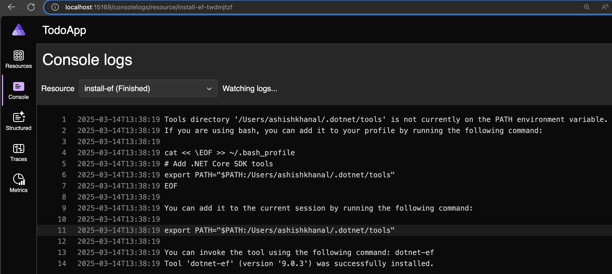

# react-aspnetcore-bff
Production ready ASP.NET Core BFF with a React frontend.

## Helpful links
1. https://auth0.com/blog/the-backend-for-frontend-pattern-bff/ (Great article, read it!)

## Local Setup
### Install azd
https://learn.microsoft.com/en-us/azure/developer/azure-developer-cli/install-azd?tabs=winget-windows%2Cbrew-mac%2Cscript-linux&pivots=os-mac

```bash
brew tap azure/azd && brew install azd
```

### Run sample app
Clone down this repo: https://github.com/Azure-Samples/todo-nodejs-mongo-swa-func

Try to put it in Azure
```bash
# Log in to azd. Only required once per-install.
azd auth login
```

```bash
# Provision and deploy to Azure
azd up
```
Looks like it executes custom 'up' workflow from azure.yaml file.

I chose the environment name as `dev`.

I chose the location as `East US` which was a mistake because looks like there are no `Static Web Apps` in `East US` region.
```bash
Validation Error Details:
LocationNotAvailableForResourceType: The provided location 'eastus' is not available for resource type 'Microsoft.Web/staticSites'. List of available regions for the resource type is 'westus2,centralus,eastus2,westeurope,eastasia'.

TraceID: 591e72b8b48d417684d3df4abe64747b
```

I reran `azd up` and the result was the same because it still "remembered" the location as `East US`.

I ran `azd config reset` and that didn't help either.

I had to hunt down the config file where this location was "stuck". I looked at `.env` and `config.json` files.
I then found the `East US` location in `.env` file and changed it to `eastus2`.

`/Users/ashishkhanal/RiderProjects/todo-nodejs-mongo-swa-func/.azure/dev/.env`

It was successful.

I cleaned up using `azd down`.

### Rerun
I reran the `azd up` command and it ran into error.

```bash
Ashishs-MacBook-Pro:todo-nodejs-mongo-swa-func ashishkhanal$ azd up
? Select an Azure location to use: 47. (US) East US 2 (eastus2)
Note: Running custom 'up' workflow from azure.yaml

Provisioning Azure resources (azd provision)
Provisioning Azure resources can take some time.

Subscription: Azure subscription 1 (8824a121-58be-47f3-b1cf-1ef308bacd6a)
Location: East US 2

  You can view detailed progress in the Azure Portal:
  https://portal.azure.com/#view/HubsExtension/DeploymentDetailsBlade/~/overview/id/%2Fsubscriptions%2F8824a121-58be-47f3-b1cf-1ef308bacd6a%2Fproviders%2FMicrosoft.Resources%2Fdeployments%2Fdev-1742313866

  (✓) Done: Resource group: rg-dev (1.34s)
  (✓) Done: Log Analytics workspace: log-wk55gniutz2yo (2.29s)
  (✓) Done: App Service plan: plan-wk55gniutz2yo (5.402s)
  (x) Failed: Key Vault: kv-wk55gniutz2yo (2.331s)
  (✓) Done: Application Insights: appi-wk55gniutz2yo (4.984s)
  (✓) Done: Portal dashboard: dash-wk55gniutz2yo (551ms)
  (✓) Done: Static Web App: stapp-web-wk55gniutz2yo (10.498s)
  (✓) Done: Storage account: stwk55gniutz2yo (21.725s)
  |===    | Creating/Updating resources
ERROR: error executing step command 'provision': deployment failed: error deploying infrastructure: deploying to subscription:

Deployment Error Details:
ConflictError: A vault with the same name already exists in deleted state. You need to either recover or purge existing key vault. Follow this link https://go.microsoft.com/fwlink/?linkid=2149745 for more information on soft delete.

TraceID: a9569b3417f554ecb28a55fd363b514e
```

Tried again:
```bash
Ashishs-MacBook-Pro:todo-nodejs-mongo-swa-func ashishkhanal$ azd up
Note: Running custom 'up' workflow from azure.yaml

Provisioning Azure resources (azd provision)
Provisioning Azure resources can take some time.

Subscription: Azure subscription 1 (8824a121-58be-47f3-b1cf-1ef308bacd6a)
Location: East US 2

  You can view detailed progress in the Azure Portal:
  https://portal.azure.com/#view/HubsExtension/DeploymentDetailsBlade/~/overview/id/%2Fsubscriptions%2F8824a121-58be-47f3-b1cf-1ef308bacd6a%2Fproviders%2FMicrosoft.Resources%2Fdeployments%2Fdev-1742314371

  (✓) Done: Resource group: rg-dev (494ms)
  (✓) Done: App Service plan: plan-wk55gniutz2yo (1.858s)
  (✓) Done: Storage account: stwk55gniutz2yo (1.716s)
  (✓) Done: Key Vault: kv-wk55gniutz2yo (2.178s)
  (✓) Done: Log Analytics workspace: log-wk55gniutz2yo (1.262s)
  (✓) Done: Static Web App: stapp-web-wk55gniutz2yo (1.247s)
  (✓) Done: Application Insights: appi-wk55gniutz2yo (909ms)
  (✓) Done: Portal dashboard: dash-wk55gniutz2yo (341ms)
  (✓) Done: Azure Cosmos DB: cosmos-wk55gniutz2yo (1m39.962s)
  (✓) Done: Function App: func-api-wk55gniutz2yo (25.124s)

Deploying services (azd deploy)

  (x) Failed: Deploying service api

ERROR: error executing step command 'deploy --all': failed deploying service 'api': POST https://func-api-wk55gniutz2yo.scm.azurewebsites.net/api/zipdeploy
--------------------------------------------------------------------------------
RESPONSE 503: 503 Site Unavailable
ERROR CODE UNAVAILABLE
--------------------------------------------------------------------------------
The service is unavailable.
--------------------------------------------------------------------------------

TraceID: ac954a66a363d120df5dd51b16358873
Ashishs-MacBook-Pro:todo-nodejs-mongo-swa-func ashishkhanal$ azd up
Note: Running custom 'up' workflow from azure.yaml

Provisioning Azure resources (azd provision)
Provisioning Azure resources can take some time.

Subscription: Azure subscription 1 (8824a1
```


## Sample apps
### David Fowler's [BFF example](https://github.com/davidfowl/TodoApp)
#### Run it
- Clone it and run it to see how it works.
- Make sure you have `dotnet-ef` tool installed.
  - This command is run by the AppHost project automatically so you don't really have to run it.
    
    `dotnet tool install --global dotnet-ef`
  - Make sure you add `dotnet-ef` tool to your PATH.
    - `export PATH="$PATH:$HOME/.dotnet/tools"`
  
      
    - More info on adding to PATH: https://stackoverflow.com/a/77428269/8644294
  - Make sure `DOTNET_ROOT` environment variable is set for `dotnet-ef` tool to work.
    - Check using `echo $DOTNET_ROOT`.
    - If not set, add it to your `.bash_profile` file.
      ```bash
      # Set DOTNET_ROOT environment variable
      export DOTNET_ROOT="$HOME/.dotnet"
      ```
  - Check if `dotnet-ef` is properly installed using `dotnet ef --version` or `dotnet-ef --version`.

#### Learn .NET Aspire (it's simple and powerful)
https://learn.microsoft.com/en-us/dotnet/aspire/get-started/aspire-overview

Watch a video on .NET Aspire if you're a visual learner:

https://youtu.be/4ixWtXK7KzY?si=SgxxsJmr92PpOkA9

#### Take a look at the code
- Go to AppHost project and see how it's implemented.
- It creates a database at `$HOME/RiderProjects/TodoApp/Todo.Api/.db/Todos.db`
  - To see hidden files in macOS Finder, press `Command + Shift + . (period)`.
